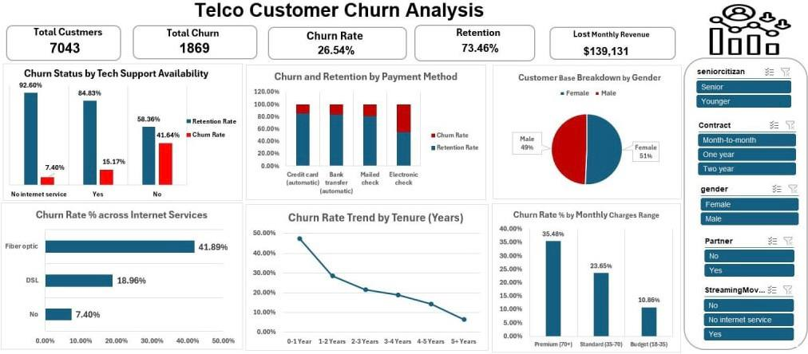

# 📞 Telco Customer Churn & Retention Analysis (Excel)

## 1. 📊 Interactive Dashboard Preview

---

## 2. 📝 Executive Summary
In the telecommunications industry, retaining existing customers is more cost-effective than acquiring new ones. This project analyzes a dataset of **7,043 customers** to identify key drivers behind customer churn (cancellation). The analysis focuses on reducing the **26.54% Churn Rate** and recovering potential lost revenue.

### 📈 Global Metrics (KPIs):
* **Total Customers:** 7,043
* **Churn Count:** 1,869 Customers
* **Churn Rate:** 26.54%
* **Lost Monthly Revenue:** $139,131
* **Current Retention Rate:** 73.46%

---

## 3. 🔍 Business Insights & Analytical Findings

### A. Service & Support Impact
* **Tech Support Gap:** Customers with **No Tech Support** exhibit a significantly higher churn rate (**41.64%**) compared to those with support. Technical frustration is a major driver of dissatisfaction.
* **Service Quality:** **Fiber Optic** users have a massive churn rate of **41.89%**, which is double the rate of DSL users. This indicates potential issues with fiber service quality or pricing.

### B. Payment & Billing Behavior
* **Payment Methods:** Customers using **Electronic Checks** are the most likely to churn. In contrast, automated payment methods (Credit Card/Bank Transfer) show much higher loyalty.
* **High-Value Churn:** Premium customers paying over **$70/month** have the highest churn rate (**35.48%**), leading to substantial revenue loss.

### C. Tenure & Loyalty Trends
* **The "Risk Zone":** The highest churn occurs within the **first year (0-12 months)** of the contract. Once a customer reaches a 5-year tenure, the churn rate drops significantly to below 10%.

---

## 🛠️ 4. Data Engineering & Methodology
To ensure high data accuracy, the following steps were performed:
* **Data Auditing:** Cleaned the dataset to handle missing values and ensured consistency in demographic data.
* **Feature Engineering:** Segmented "Monthly Charges" into Budget, Standard, and Premium tiers and binned "Tenure" into yearly intervals to identify trends.
* **Advanced Visualization:** Built a dynamic Excel dashboard using **Pivot Tables, Slicers, and Conditional Formatting** to highlight financial impact (Lost Revenue).

---

## 💡 5. Strategic Recommendations
1. **First-Year Engagement:** Launch a "Customer Success" program specifically for users in their **first 12 months** to reduce early-stage churn.
2. **Support Bundling:** Offer discounted **Tech Support** to high-risk segments to increase service "stickiness."
3. **Fiber Optic Review:** Conduct a technical and pricing audit of Fiber Optic services to understand why it has the highest churn rate.
4. **Auto-Pay Incentives:** Provide small discounts or rewards for switching to **Automatic Payment** methods to improve long-term retention.

---

## 📂 Project Structure
* `Telco-Customer-Churn.csv`: Cleaned dataset used for analysis.
* `Dashboard_Preview.jpg`: Final high-resolution dashboard visualization.
